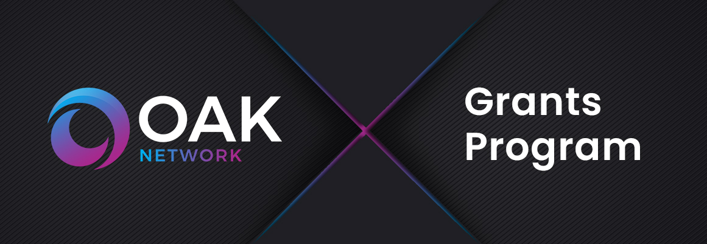

# OAK Network Grants Program<!-- omit in toc -->

  

- [Introduction](#introduction)
  - [Guidelines](#guidelines)
  - [Project ideas](#project-ideas)
  - [Support](#support)
- [Levels](#levels)
  - [Level 1 (= InstaGrants) :hatching\_chick:](#level-1--instagrants-hatching_chick)
  - [Level 2 :baby\_chick:](#level-2-baby_chick)
  - [Level 3 :rooster:](#level-3-rooster)
- [Process](#process)
- [Proposal Suggestions](#proposal-suggestions)
- [Maintenance Grants](#maintenance-grants)
- [Additional Resources](#additional-resources)
  - [Documentation](#documentation)
  - [Community](#community)
- [Alternative Funding Sources](#alternative-funding-sources)
  - [Treasury](#treasury)
  - [Hackathons](#hackathons)

## Introduction

As part of our commitment to promoting the OAK Network ecosystem, we offer comprehensive grants programs focused on funding dApp development and research efforts related to **OAK Network and Turing Network**. For more information about the Grants Program, please visit the page of [Competitions and Grants](https://oak.tech/community/grants/) on our website.

### Guidelines

Anyone is welcome to apply for a grant. Projects funded through our programs are broad in scope, but our focus lies on strong **technical** projects that add value to the ecosystem.

Generally, your project will have better chances to be accepted if:

- It presents a **well-researched** or tested concept, for which ideally you are able to show some prior work.
- You can demonstrate that the project will be **maintained** after completion of the grant, be it through an obvious commitment to the technology from your side, additional funding sources or an existing business model.
- Your team has **proven experience** with the relevant languages and technologies and/or a strong technical background. You will be asked to provide the GitHub profiles of your team members as part of your application, which we will examine these for past activity and code quality. Naturally, you can also link to projects on other platforms.
- Your application is **rich in technical details** and well-defined.
- You can clearly present how your project stands out among competitors or implements technology that doesn't exist in the ecosystem yet.

Additionally, it must fulfill the following requirements:

- All code produced as part of a grant must be **open-sourced**, and it must also not rely on closed-source software for full functionality. We prefer Apache 2.0, but GPLv3, MIT or Unlicense are also acceptable.
- We do not award grants for projects that have been the object of a successful token sale.
- As a general rule, teams are asked to finish a grant before applying for another one.
- Lastly, we do not fund projects that actively encourage gambling, illicit trade, money laundering or criminal activities in general.

In addition to the information provided on your application, note that your project will need to comply with our [Guidelines for Milestone Deliverables](docs/milestone-deliverables-guidelines.md). In particular, we require all projects to create documentation that explains how their project works. At a minimum, _written_ documentation is required for funding. Tutorials or videos are also helpful for new users to understand how to use your product. 

Please also heed our [Announcement Guidelines](docs/announcement-guidelines.md) for grant-related communications.

Finally, we take licensing and the right of all teams in and outside the ecosystem to be recognized for their work very seriously. Using others' work with no attribution or indication that this was not your own work as part of a milestone delivery **will lead to immediate termination**. Please reach out to us before submitting if you have any doubts on how to comply with a specific license and we'll be happy to help.

### Project ideas

An overview of existing projects in the Web 3.0 Technology Stack along with broad project ideas we would potentially be interested in funding can be found in the [Proposals](./proposals) folder, as well as a list of previously accepted applications in merged Pull Requests.

[Proposals](./proposals) represents ideas for projects that we would like to see implemented. Several teams may apply for the same proposal, so even if another team has already applied to implement a certain proposal, we invite you to do the same if you're interested.

Finally, you don't need to start your own project in order to be eligible for a grant. Instead, some teams choose to port existing work to Substrate, where the pertinent licenses allow, or even to contribute to an existing open-source project. In the latter case, you should check in advance that the maintainers of the project are interested in your contribution, and the acceptance of the milestones will generally be tied to the inclusion of your work in said project. See the [Maintenance Grants section](#maintenance-grants) for more info.

If you have a **good concept of the technical challenges** that your idea entails and would like feedback before applying, you can reach out to our [Discord](https://discord.com/invite/7W9UDvsbwh) and tell us about it.

### Support

The scope of our Grants Programs consists of funding and feedback on delivered milestones. This means that we do not provide hands-on support as part of a grant, but if you face specific issues during development, we will do our best and try to direct you to the correct resources. You can find general documentation and more information on Substrate on the [OAK Documentations](https://docs.oak.tech/docs/developer-guide-overview/), and we encourage you to join our [Discord](https://discord.com/invite/7W9UDvsbwh) in order to get help with specific issues or to stay up to date with the most recent developments.

For questions about the grants program itself, see our [FAQ](docs/faq.md#frequently-asked-questions).

## Levels

The OAK Network Grants Program offers different grant levels to help you best depending on your current stage.

### Level 1 (= InstaGrants) :hatching_chick:
  - **Target:** Individuals & small teams
  - **Amount:** Up to $10,000
  - **Benefits:** Feedback during application process and evaluation, introduction to related teams/projects

### Level 2 :baby_chick:

- **Target:** Small teams/start-ups 
- **Amount:** Up to $50,000
- **Benefits:** All of the above + [co-promotion](./docs/announcement-guidelines.md#announcement-guidelines).

### Level 3 :rooster:

- **Target:** Companies/foundations with a proven track record 
- **Amount:** Up to $250,000
- **Requirements:** Pitch call with the OAK team, and Council approval) 
- **Benefits:** All of the above + VC introductions

## Process

> **:loudspeaker:** The process below is independent of the [level](#level_slider-levels). Payment is made in USDC, TUR and OAK. 

1. **Application**
   1. [Fork](https://github.com/OAK-Foundation/Grants-Program/fork) this repository.
   2. In the newly created fork, create a new file and copy the content of the [Application Template](applications/application-template.md) over. Please **DO NOT modify the template file directly**.
   3. Name the new file after your project: `project_name.md`.
   4. Fill out the template with the details of your project. The more information you provide, the faster the review. To get an idea of what a strong application looks like, you can have a look at the following examples:  [1](https://github.com/OAK-Foundation/Grants-Program/blob/master/applications/project_aurras_mvp_phase_1.md), [2](https://github.com/OAK-Foundation/Grants-Program/blob/master/applications/project_bodhi.md), [3](https://github.com/OAK-Foundation/Grants-Program/blob/master/applications/pontem.md), [4](https://github.com/OAK-Foundation/Grants-Program/blob/master/applications/spartan_poc_consensus_module.md). Naturally, if you're only applying for a smaller grant that only consists of, say, UI work, you don't need to provide as much detail.
   5. Once you're done, create a pull request, or PR for short. The pull request should **only contain one new file** which is your application created from the template.
   6. The Pull Request will contain a checklist. You should leave it as is and tick the checkboxes once the pull request has been created. Please read through these items and check all of them.
   7. Sign off on the [terms and conditions](docs/T&Cs.md) presented by the [CLA assistant](https://github.com/claassistantio) bot as a Contributor License Agreement. You might need to reload the pull request to see its comment.
2. 
3. **Application Review**
   1. The [OAK Grants Committee](#oak-grants-committee) will review, issue comments and request changes on the pull request.
   2. Clarifications and amendments made in the comments **need to be included in the application**. You may address feedback by directly modifying your application and leaving a comment once you're done. Generally, if you don't reply within 2 weeks, the application will be closed due to inactivity, but you're always free to reopen it as long as it hasn't been rejected.
   3. When all requested changes are addressed and the terms and conditions have been signed, someone will mark your application as `ready for review` and share it internally with the rest of the committee.
   4. The application will be accepted and merged as soon as it receives the required number of approvals (see [levels](#level_slider-levels)), or closed after two weeks of inactivity. Unless specified otherwise, the day on which it is accepted will be considered the starting date of the project, and will be used to estimate delivery dates.
   5. 
4. **Milestone Delivery and Payment**
   1. Milestones are to be delivered to the [Deliveries](./deliveries) folder following the [process](./delivereis/README.md) described therein.

:warning: Accepted grant applications can be amended at any time. However, this **necessitates a reevaluation by the committee**. If your application has been accepted and, during development, you find that your project significantly deviates from the original specification, please open a new pull request that modifies the existing application.

Additionally, we try to enforce the [code of conduct](CODE_OF_CONDUCT.md) and based on this may [block users](https://github.blog/2016-04-04-organizations-can-now-block-abusive-users/).

## Proposal Suggestions

If you think that we should support the development of certain tools or projects (related to **OAK Network or Turing Network**), feel free to submit an Proposal suggestion using the process described below. We are particularly interested in supporting projects that could be leveraged by other builders in our ecosystem. We will review your proposal and, if we believe it’s useful, will create a Proposal based on your idea and try to find teams to work on it.

**Instructions for submitting a Proposal suggestion:**

1. [Fork](https://github.com/OAK-Foundation/Grants-Program/fork) this repository.
2. In the newly created fork, create a new file under [proposals](./proposals) and copy the content of the suggestion template ([`proposals/suggestion-template.md`](proposals/suggestion-template.md)) over. Please **DO NOT modify the template file directly**.
3. Name the file after your idea: `proposal_name.md`.
4. Fill out the template with the proposal details. Please include as many details as possible.
5. Once you're done, create a pull request. The pull request should **only contain one new file**, that is the proposal file you just created.
6. You will see the same pull request template as for creating an application. Please replace it with [proposal_pr_template.md](.github/PULL_REQUEST_TEMPLATE/proposal_pr_template.md).

If you have an idea for a project but lack the technical background to create a detailed outline, you can open an [issue](https://github.com/OAK-Foundation/Grants-Program/issues/new) instead. However, your idea will have better chances of being implemented if you can provide a project outline such that it can be picked up straight away by a capable team.

## Maintenance Grants

Maintenance Grants are yet another idea to get involved with the OAK community. If you are a user of an open-source library that has gone out of date, or you simply want to work on new features/fix bugs in these repos, we can support your contributions via a grant. We are happy to award rolling grants on a monthly basis, as long as the work done within each time period is performed to a quality standard deemed satisfactory by the grant evaluators.

The process of applying for a Maintenance Grant is similar to what was already outlined above, but instead of defining very detailed deliverables for each milestone upfront, we will ask you to specify, where possible:
- The repo(s) that need maintenance
- Outline of why the specific project should continue being supported
- Broad overview of the features/bugs that need development contributions
- An assurance that the current project owners are willing to review/accept your contributions (a note here: if you're fully taking over the project, it would make more sense for the current owners to transfer the repository to your organization. If you can't get in touch with them, you may of course work on a fork)
- Max budget per month

Then, at the end of each month, you will need to provide a comprehensive report of the work done, including the list of issues/bugs/pull requests worked on, time spent on each of these & finally the associated cost. It is quite likely that the time allocation & cost will vary from month to month, depending on the nature of the project you're contributing to. The report should be in the form of a Milestone Delivery, again like the typical procedure. The payments will be done after the successful merge of each individual report.

Please bear in mind that the Grants Committee might be more strict in accepting maintainers when compared to typical grants, mostly selecting for applicants with proven experience in the relevant tech stacks.

Note: the 1-month timeframe is just a guideline. If you find it unsuitable for you or the chosen project for any reason, feel free to adjust as seen fit and point this out in your application.

## Additional Resources

### Documentation
* [Website](https://oak.tech/)
* [Documentation](https://docs.oak.tech/)
### Community
* General discussion: [Telegram](https://t.me/OAK_Announcements)
* Technical discussion: [Discord](https://discord.gg/7W9UDvsbwh)
* Follow us on [Twitter](https://twitter.com/oak_network) or [LinkedIn](https://www.linkedin.com/company/oak-blockchain/)
* Subscribe to [Medium Newsletter](https://medium.com/oak-blockchain)

## Alternative Funding Sources

Some funding sources might be more and some less suitable for your project throughout its various stages. We encourage you to explore alternative funding options listed below. Please note, however, that you should not seek to fund the **same scope of work** from multiple sources and that any team found doing so will have its OAK Network support terminated.

### Treasury

The treasury is a pot of on-chain funds collected through transaction fees, slashing, staking inefficiencies, etc. The funds held in the treasury can be spent on spending proposals. Both Turing Network and OAK Network offer everyone the opportunity to apply for funding via the treasury. See:

- [Polkadot’s Treasury Wiki](https://wiki.polkadot.network/docs/en/learn-treasury)
- [Turing Network Governance Update Nov 22’](https://medium.com/oak-blockchain/turing-network-governance-update-69e51b3d9d4f)
- [Youtube Governance Discussions with Bill Laboon](https://www.youtube.com/watch?v=LCCGTuYw1Uo)

### Hackathons

From time to time, OAK Network organizes hackathons (see [oak.tech/community/grants](https://oak.tech/community/grants/)) to promote quick prototyping of OAK related ideas. We highly encourage you to participate in these hackathons. Bear in mind, however, that you cannot submit the **same work** for a hackathon and the Grants Program. If you have worked or are planning to work on a project for a hackathon, your grant application should either propose a different set of features or otherwise build on top of your hackathon work. The same applies in reverse, although that will likely be less common.

The best way to find out about upcoming hackathons is by following OAK Network on the various social channels, such as [Twitter](https://twitter.com/oak_network) or [LinkedIn](https://www.linkedin.com/company/oak-blockchain/).

## License<!-- omit in toc -->

[Apache License 2.0](LICENSE) © OAK Network
